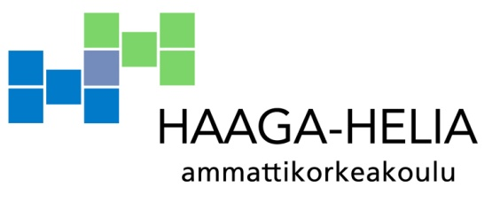
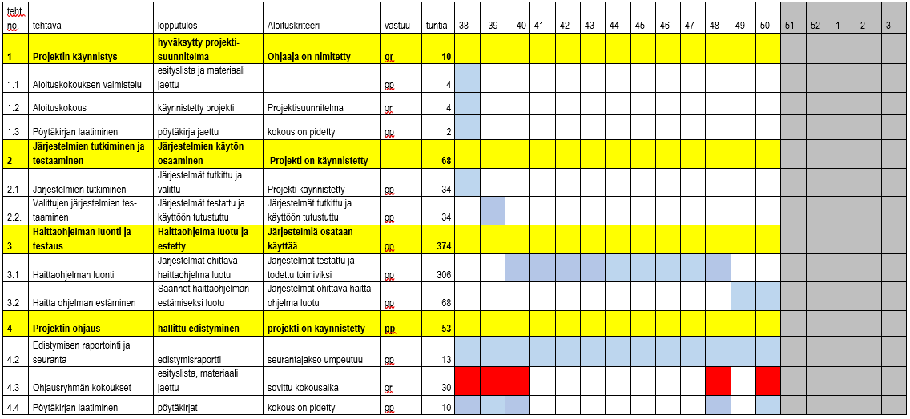

Virusturvan ja IDS:n ohittaminen   

Tommi Timonen

Aleksi Salminen   

Projektisuunnitelma

Monialaprojekti

19.09.2018   

# Sisällys

1 Projektimääritys 1

1.1 Projektin tausta 1

1.2 Projektin tehtävä 1

1.3 Projektin tavoite ja lopputulokset 1

1.4 Projektin rajaus 1

1.5 Projektin organisaatio ja kumppanit 2

1.6 Projektin budjetti ja aikataulu 2

1.7 Projektin riskit ja projektin onnistumisen edellytykset 2

2 Työsuunnitelma 3

2.1 Kokonaistyön vaiheistus ja ajoitus 3

2.2 Projektinhallinnolliset menettelytavat 3

2.3 Muut projektissa käytettävät menetelmät 4

Liite 1 Projektin tehtävät, työmäärät ja ajoitus 1

Projektimääritys
================

1.1 Projektin tausta
--------------------

Projekti aloitetaan projektin jäsenten tietämyksen ja oppimisen edistämiseksi.
Projektin jäsenten kiinnostus tietoturvaa kohtaan, johti aihealueen valintaan,
mutta Tero Karvisen avustuksella saimme tarkennettua projektin idean, jota
alamme työstää.

Pohjalla projektin jäsenillä on tietoturvan perusteet ja ohjelmoinnin perusteet
kurssit, sekä tällä hetkellä kesken oleva tietoturvan hallinta kurssi.

Projektilla tavoitellaan tunkeutumisenhavaitsemisjärjestelmien ja virusturvan
toiminnan ymmärtämistä syvällisemmin, sekä haittaohjelmien käyttäytymistä.

1.2 Projektin tehtävä
---------------------

Projekti tutkii ja testaa virusturvan, IDS:n ja haittaohjelmien toimintaa.

1.3 Projektin tavoite ja lopputulokset
--------------------------------------

Tavoitteena projektilla on tutustua virusturvan ja
tunkeutumisenhavaitsemisjärjestelmän toimintaan, sekä pyrkiä luomaan
haittaohjelma, joka ohittaa kummatkin järjestelmät. Jos projekti onnistuu ja
saamme ohitettua järjestelmät, niin projekti jatkuu uuden haittaohjelman esto
sääntöjen luomisella.

Pohjustavasti tunkeutumisenhavaitsemisjärjestelmäksi on valittu Suricata, mutta
virusturvaa ei ole vielä päätetty.

Oppimistavoitteena on järjestelmien toiminnan syvempi tuntemus, sekä virusten
toiminnan syvempi tuntemus.

1.4 Projektin rajaus
--------------------

Projektin tarkoituksena ei ole vertailla eri
tunkeutumisenhavaitsemisjärjestelmiä tai virusturvia, vaan tutustua niiden
toimintaan.

1.5 Projektin organisaatio ja kumppanit
---------------------------------------

Projektipäällikkönä toimii Tommi Timonen ja sihteerinä toimii Aleksi Salminen.

Projektin loppuraportti tulee vapaasti tarkasteltavaksi, jolloin kuka tahansa
voi lukea raportin ja oppia hieman lisää järjestelmien toiminnasta.

1.6 Projektin budjetti ja aikataulu
-----------------------------------

Projekti alkaa viikolla 38 projektisuunnitelman esittelyn ja korjauksen jälkeen
ja päättyy viikolla 49.

Projektin budjettina toimii jokaiselle tekijälle kohdistetut työtunnit eli 270
tuntia/tekijä.

Projektissa käytetään primääristi avoimenlähdekoodin ja ilmaisia ohjelmistoja,
joten kuluja ohjelmistoista ei tule.

1.7 Projektin riskit ja projektin onnistumisen edellytykset
-----------------------------------------------------------

Projektin uhkana on uuden opittavan määrä. Projektissa tulee paljon uutta
opittavaa, jonka takia aikataulussa pysyminen saattaa olla haastavaa. Uhka
pyritään minimoimaan priorisoimalla ajan käyttö projektia varten.

Projektin onnistumisen edellytyksenä on järjestelmien ja ohjelmien oppiminen ja
tarvittava järjestelmien testaus. Järjestelmät pitää tuntea tarpeeksi hyvin,
jotta testaus voidaan suorittaa luotettavasti.

 2 Työsuunnitelma
====================

Projekti aloitetaan tunkeutumisenhavaitsemisjärjestelmä ja
virustorjuntaohjelmistojen tutkimisella ja testausohjelmistojen valinnalla.
Tähän arvioidaan menevän viikko.

Valintojen jälkeen järjestelmät asennetaan ja aloitetaan niiden toimintaan
tutustuminen. Tutustumisen lopputuloksena meillä on oletusasetuksilla toimiva
IDS, sekä virustorjunta. Ohjelmien toiminta testataan yksinkertaisella
haittaohjelmalla. Virustorjunta laitetaan Virtual boxiin Windows
käyttöjärjestelmälle ja eristetään verkosta. Tähän on varattu aikaa viikko.

Tutustumisen jälkeen rupeamme selvittämään virusten toimintaa ja pyrimme
ohittamaan järjestelmät. Tässä vaiheessa koodaamme ja testaamme haittaohjelmia,
joilla pyrimme ohittamaan IDS ja virustorjunta järjestelmät. Lopputuloksena on
siis haittaohjelma, jota ei havaita järjestelmissä ja joka pystyy demonstroimaan
haittaohjelman toimintaa keräämällä ja lähettämällä tiedostoja koneelta
toiselle. Tämä on ehdottomasti haastavin vaihe, johon on varattu aikaa 9
viikkoa.

Kun olemme onnistuneet luomaan haittaohjelman, joka ohittaa järjestelmät,
rupeamme luomaan järjestelmiin uusia sääntöjä, joilla uusi haittaohjelma saadaan
estettyä. Lopputuloksena IDS ja virusturva osaavat estää haittaohjelmamme. Tähän
arvioidaan menevän kaksi viikkoa.

Työlle on varattu aikaa torstaisin klo 12-18, perjantaisin klo 11-16 ja
maanantaisin klo 12-16.

2.1 Kokonaistyön vaiheistus ja ajoitus
--------------------------------------

Kohdassa 2 työsuunnitelmasta käy tarkemmin ilmi projektin eteneminen ja
Liitteessä 1 näkyy projektin eri vaiheille varattu aika.

2.2 Projektinhallinnolliset menettelytavat
------------------------------------------

Kaikki projektiin liittyvät päätökset tehdään kollektiivisesti ryhmänjäsenten
kanssa painottaen projektipäällikön mielipidettä. Projektipäällikkö pitää ryhmän
jäsenet ajan tasalla projektikokousten materiaalista parhaaksi näkemällään
tavalla ja sopivalla ajankohdalla. Kaikista kokouksista ilmoitetaan projektin
jäsenille. Mikäli projektia ei voida syystä tai toisesta edistää
projektisuunnitelmassa suunnitellun mukaisesti, tekee projektipäällikkö
päätöksen muutoksista ja aikataulu korjauksista, sekä ilmoittaa muutoksista
ryhmän jäsenille.

2.3 Muut projektissa käytettävät menetelmät
-------------------------------------------

Projektiin valitaan tunkeutumisenhavaitsemisjärjestelmä ja virusturva
tutkintavaiheen aikana. Projekti toteutetaan dynaamisesti ja mukautetaan sitä
mukaan, kun ymmärrämme järjestelmistä enemmän.

Liite 1 Projektin tehtävät, työmäärät ja ajoitus
================================================

Taulukossa pp = projektipäällikkö, or = ohjausryhmä/ ohjauskokous. Punaiset
ruudut paikantavat ohjauskokouksia ko. viikolle, vaalean siniset ruudut
tarkoittavat, että työtä tehdään ko. viikolla, harmaat ruudut kuvaavat
lomajaksoa, keltaiset kokoavat työvaiheen.

